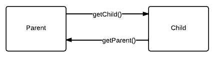

Relationships
=============

Relationships can be quickly defined using ``model.hasOne()`` and ``model.hasMany()`` methods in the :doc:`ref/model`.

.. note::
	<relationship> is the name of the relationship you pass to the relationship creation methods.

One-to-one relationship
-----------------------

When defining this it assumes the current model can only have 1 of the other model.

It provides a number of methods such as ``instance.get<relationship>()`` on the current model. If you have enabled autoFetch then it will appear as a property on the model (bear in mind this may take slightly longer to return).

Also (@kennydude's version only!) you can reverse-lookup one-to-one relationships very quickly using ``model.findBy<relationship>( otherModel, ... )`` which makes it very useful.

If you have a social network, you may want to find all of 1 user's messages, so you could do ``messages.findByUser( myuser, function(err, results){ ... } )`` which would work well.

Many-to-many relationships
--------------------------

Similar to the above, except works for more than one item.

However, it introduces some more methods than the above which are as follows:

* ``instance.set<relationship>( items, function(err){ ... } )``: This replaces the whole list of items that the current instance is related to. Please note: This is not recommended if you can avoid it
* ``instance.remove<relationship>( function(err){ .. } )``: Destroys the whole list
* ``instance.remove<relationship>( items, function(err){ .. } )``: Removes the specified items from the list
* ``instance.add<relationship>( item, extra, function(err){ .. } )``: Adds the specified item to the list. (Extra is optional, and you can add as many instances as you pass of the other model)

Reverse Relationships
---------------------

If you pass the reverse option in your model, it allows the child models to get the associated parent model.

To put it into more sense here is a diagram where we have said::
	
	parent.hasOne("child", child, {
		"reverse" : "parent"
	});

